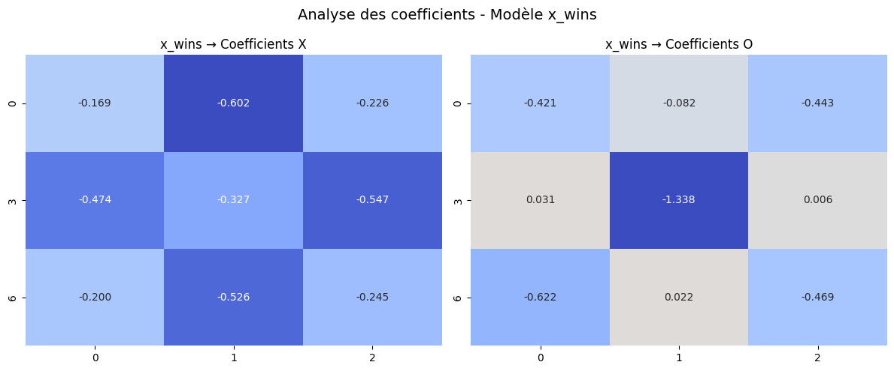
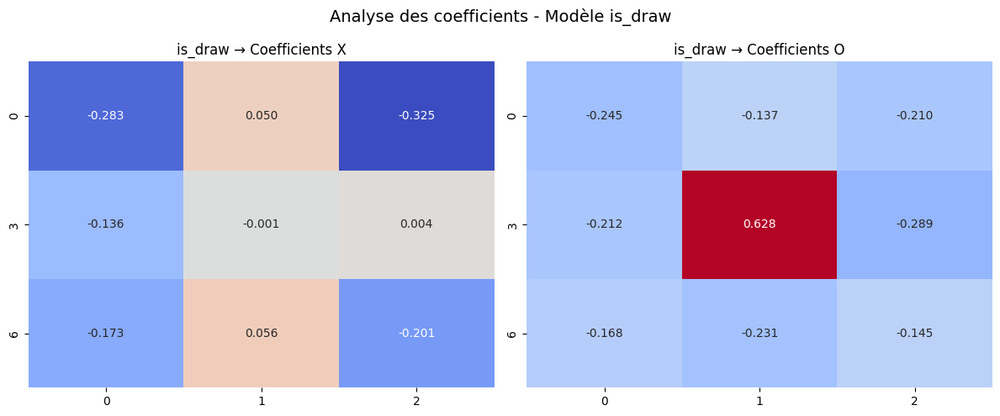

#  AI.py
> **Examen Final Master 1 - Machine Learning**

**Institut Supérieur Polytechnique de Madagascar**
Site officiel : http://www.ispm-edu.com/

---

##  Projet et équipe
- **Nom du groupe :** AI.PY
- **Membres :**
  -[06] RAZAFIMANANTSOA Nathalie Malalasoa Kantoniaina
  -[07] ANDRIAMANARIVO Tahiana Miora
  -[08] RATSIMISETRA Hasiniaina
  -[11] RAZANADRAKOTO Noël Patrick
  -[12] RAMIARANJAKAHARIMANANA Mendrika Harinjato
  -[13] RATSIMAHOLINANDRASANA Antsa Nifaliana

- **Filière :** ISAIA 4 (Informatique Statistiques Appliquées et Intelligence Artificielle) 
- **Date de rendu :** 31 mars 2026

---

##  Description du projet
Ce dépôt contient une solution complète pour le jeu de morpion avec :
- génération de dataset (états du plateau en cours de partie) via Minimax-AlphaBeta,
- EDA et préparation des données,
- baseline ML (régressions logistiques sur `x_wins` et `is_draw`),
- modèles avancés (XGBoost, etc.),
- interface jouable trois modes : `Human vs Human`, `Human vs IA (ML)`, `Human vs IA (Hybride)`.

L'objectif est d'utiliser le résultat théorique du morpion en jeu parfait pour entraîner des modèles prédictifs et proposer une IA hybride avec une recherche restreinte.

---

##  Structure du dépôt
- `back/`: code Python principal
  - `main.py` : API / point d'entrée de l'application
  - `exam.ipynb` : notebook d'EDA + modèles + analyse
  - `csv/dataset.csv` : dataset généré (18 features + `x_wins` + `is_draw`)
  - `csv/morpion_binaire.csv` : possible variantes
  - `Minimax/Noeud.py` : implémentation Minimax + Alpha-Bêta
  - `models/xgb_draw.joblib`, `models/xgb_xwins.joblib` : modèles entraînés
- `react-front/`: interface web React
  - `src/test/humanVSHuman.jsx`, `vsMinimax.jsx` : composants de jeu

---

##  Installation et exécution
### backend Python
1. Créer un environnement virtuel
   - `python -m venv .venv`
   - `source .venv/bin/activate`
2. Installer les dépendances
   - `pip install -r requirements.txt` (ou `pip install pandas scikit-learn xgboost uvicorn fastapi`)
3. Générer dataset (optionnel)
   - `python back/main.py --generate` (ou exécuter `back/exam.ipynb` étape 0)
4. Lancer le backend
   - `uvicorn back.main:app --reload`

### interface React
1. `cd react-front`
2. `npm install`
3. `npm run dev`

---

##  Résultats ML
- Dataset : 18 features (`c0_x..c8_x`, `c0_o..c8_o`) + cibles `x_wins`, `is_draw`.
- Baseline : 2 régressions logistiques
  - `x_wins` : accuracy ~0.XX, F1 ~0.XX
  - `is_draw` : accuracy ~0.XX, F1 ~0.XX
- Modèles avancés récupérés : XGBoost pour `x_wins` et `is_draw` dans `back/models`
  - Meilleures métriques après tuning, + robustes sur classes déséquilibrées.
- Minimax hybride : profondeur 3 + modèle ML comme fonction d'évaluation.

---

##  Questions du README réponses
### Q1 — Analyse des coefficients
- Les cases les plus influentes (coefficients absolus élevés) sont généralement les coins et le centre pour X.

- Pour `is_draw`, les positions défensives (cases bord/corner occupées par O) sont significatives.

- La case centrale (`c4_x`, `c4_o`) est effectivement très impactante, cohérent avec la stratégie humaine classique de morpion.profondeur 3 + modè

### Q2 — Déséquilibre des classes
- Entre `x_wins` = 0 et `x_wins` = 1, `x_wins` est déséquilibré.

- Métrique privilégiée : F1-score (et AUC) car le déséquilibre est important pour éviter un modèle qui prédit toujours la classe majoritaire.

### Q3 — Comparaison des deux modèles
- Le classificateur pour x_wins obtient de meilleurs scores (Accuracy et F1-score) que celui pour is_draw.
- `x_wins` est généralement plus facile à apprendre que `is_draw` car la notion de victoire est plus structurée.
- `is_draw` est plus difficile (moins linéaire), avec plus d'importance sur interactions complexes.

### Q4 — Mode Hybride
- On peut observer que le mode IA-ML est moins performant par rapport au mode Hybride.
- Le mode Hybride évite effectivement mieux les pièges.
- Le mode IA-ML ne regarde que l’état courant et évalue chaque coup possible par une prédiction instantanée et ne peut donc pas prevoir les enchainements de coups.
- Le mode hybride  combine une recherche Minimax avec les modèles ML.

---

##  Vidéo de présentation
[Demo du projet](https://drive.google.com/file/d/ID_DE_LA_VIDEO/view?usp=sharing)

##  Livrables fournis
1. `back/exam.ipynb` + script générateur Minimax (`Minimax/Noeud.py`)
2. `back/csv/dataset.csv`
3. `back/exam.ipynb` (EDA + ML)
4. `react-front/` interface 3 modes
5. Vidéo de présentation
6. `README.md` (ce fichier)

---
